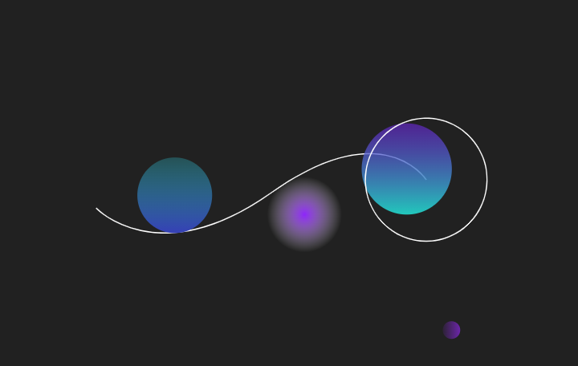
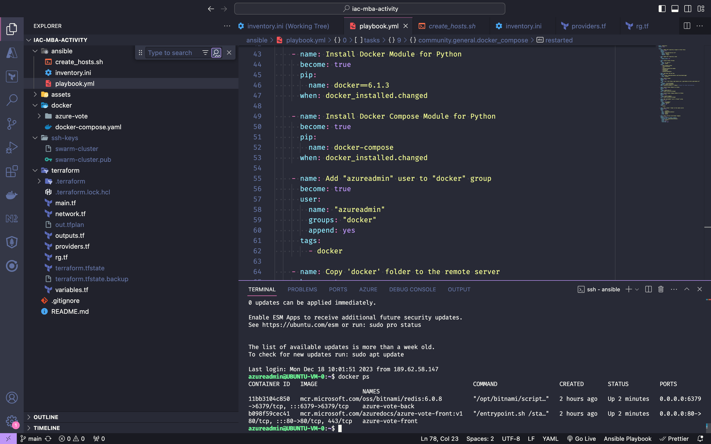
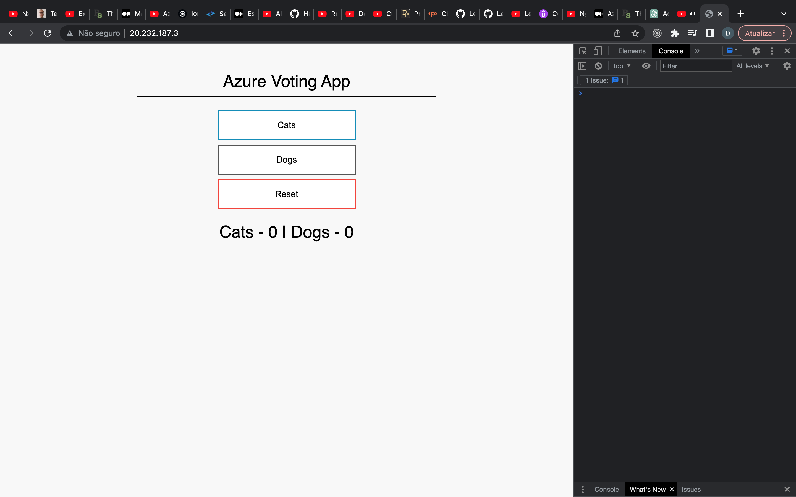
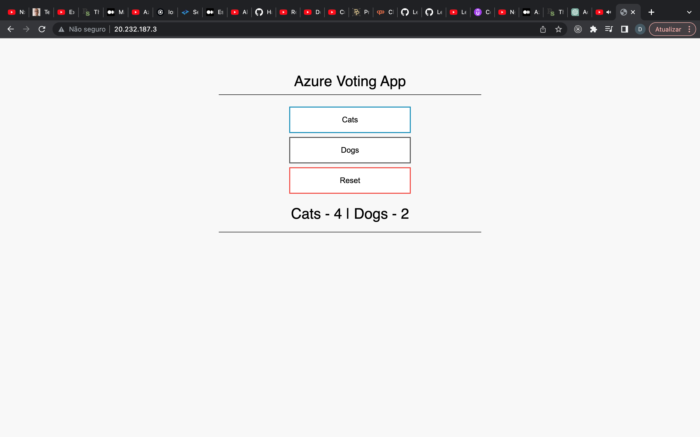

# IaC MBA Activity

<h1 align="center">
  
    <br>
</h1>

<h4 align="center">
  Infraestructure as Code MBA Activity
</h4>

<p align="center">


</p>

<p align="center">
  <a href="#computer-technologies">Technologies</a>&nbsp;&nbsp;&nbsp;|&nbsp;&nbsp;&nbsp;
  <a href="#installing-the-application">How to run Terraform and Ansible</a>&nbsp;&nbsp;&nbsp;|&nbsp;&nbsp;&nbsp;
  <a href="#page_facing_up-license">License</a>&nbsp;&nbsp;&nbsp;|&nbsp;&nbsp;&nbsp;
  <a href="#mailbox_with_mail-get-in-touch">Get in touch</a>
</p>
<br><br>

### :computer: Technologies

This project was developed with the following technologies:

- [Terraform](https://www.terraform.io)
- [Ansible](https://www.ansible.com)
- [Docker](https://www.docker.com)
- [Azure](https://azure.microsoft.com/en-us/free)
- [Redis](https://redis.io)

### Setup

Clone repository

```bash
# Clone the repository
$ git clone https://github.com/jurfest/iac-mba-activity.git

# Go to project's folder
$ cd https://github.com/Jurfest/iac-mba-activity

# Open vscode - if wanted - or continue in the terminal or open another IDE
$ code .

```

Connect to your Azure account

```bash
# Opens a new window to connect to the Azure cloud provider
$ az login

```

Generate ssh-keys folder
```bash
# Create ssh-keygen folder
$ mkdir ssh-keygen

$ cd ssh-keygen

# Generate public and private key files by responding to prompt questions
$ ssh-keygen

$ cd ..

```

### How to run Terraform and Ansible

#### Running Terraform

```bash
# Go to terraform folder
$ cd terraform

# Run necessary terraform commands
$ terraform init
$ terraform plan
$ terraform apply -auto-approve
$ cd ..
```

#### Running Ansible
```bash
# Go to ansible folder
$ cd ansible

# Generate inventory file
$ bash create_hosts.sh

# Run playbook with verbosity
$ ansible-playbook -i hosts.ini playbook.yml -vvv
```

### :microscope: How to inspect the result

Inside the browser:

<p>http://public_ip</p>

### Preview

<h1 align="center">
    
</h1>
<h1 align="center">
    
</h1>
<h1 align="center">
    
</h1>

### Acknowledgment
This Infrastructure as Code (IaC) exercise is built upon an Azure Sample showcasing a comprehensive full stack application called [Azure Voting App](https://github.com/Azure-Samples/azure-voting-app-redis.git).

### :page_facing_up: License

This project is under the MIT license.

### :mailbox_with_mail: Get in touch!

[LinkedIn](https://www.linkedin.com/in/diegojurfest/)

### Thats it ! :wave:

---

by Diego Jurfest :tada:


<!-- <div align="left">
  
  
  
  
  
  
  
  
  
  
</div>

###

<div align="center">
  <a href="https://angular.io/">
    
  </a>
  <a href="https://nx.dev/">
    
  </a>
  <a href="https://tailwindcss.com/">
    
  </a>
  <a href="https://storybook.js.org/">
    
  </a>
  <a href="https://www.figma.com/design/">
    
  </a>
</div>

### -->